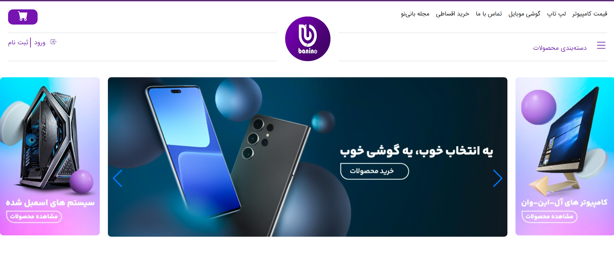

 
 

<h3 align="center">banino website</h3>

An awesome website template to practice  projects!
 
 
<a href="https://github.com/rmrady/banino"><strong>Explore the docs »</strong></a>

  

 ## About The Project

I am learning API and decided to choose this site as a small exercise for myself
 ### Built With

this website is made with:

- [Html](https://html.com)
- [Css](https://css.com)
- [tailwind](https://tailwindcss.com)
- [JavaScript](https://javascript.com)
 ## Contact

Your Name - [Razieh-Moradi] (rmrady758@gmail.com)

Project Link: (https://github.com/rmrady/banino)
